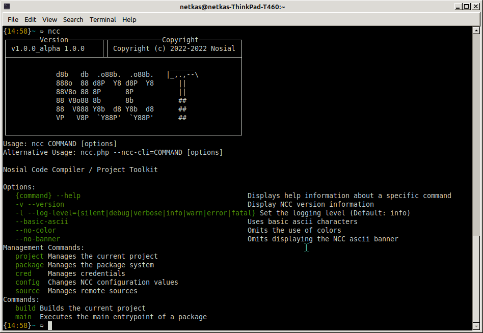

# NCC Documentation

This document serves the purpose of presenting the documentation for using/developing
NCC, from basic installation, basic usage, standards and much more.

## Table of contents

<!-- TOC -->
* [NCC Documentation](#ncc-documentation)
  * [Table of contents](#table-of-contents)
  * [Introduction](#introduction)
  * [What is NCC?](#what-is-ncc)
* [Building NCC from source](#building-ncc-from-source)
  * [Requirements to build](#requirements-to-build)
  * [Installing phpab](#installing-phpab)
  * [Building NCC](#building-ncc)
    * [Redist](#redist)
    * [Tar](#tar)
* [Installing NCC](#installing-ncc)
  * [Command line arguments](#command-line-arguments)
* [Uninstalling NCC](#uninstalling-ncc)
* [NCC Command-line Interface](#ncc-command-line-interface)
  * [Management Commands](#management-commands)
  * [Utility Commands](#utility-commands)
  * [Options](#options)
* [Projects](#projects)
  * [Creating a project](#creating-a-project)
  * [project.json structure](#projectjson-structure)
    * [project](#project)
    * [project.compiler](#projectcompiler)
    * [project.update_source](#projectupdatesource)
    * [project.update_source.repository](#projectupdatesourcerepository)
    * [assembly](#assembly)
    * [execution_policies](#executionpolicies)
      * [execution_policy](#executionpolicy)
      * [execution_policy.execute](#executionpolicyexecute)
      * [execution_policy.exit_handlers](#executionpolicyexithandlers)
      * [exit_handler](#exithandler)
    * [installer](#installer)
    * [build](#build)
    * [dependency](#dependency)
      * [Source Types](#source-types)
* [Execution Policies](#execution-policies)
  * [Supported Runners](#supported-runners)
  * [Configuring Runners](#configuring-runners)
* [Remote Sources](#remote-sources)
  * [Supported sources](#supported-sources)
  * [Default sources](#default-sources)
  * [Managing sources](#managing-sources)
    * [Adding a source](#adding-a-source)
    * [Removing a source](#removing-a-source)
    * [Listing sources](#listing-sources)
  * [Credential Management](#credential-management)
    * [Adding credentials](#adding-credentials)
    * [Removing credentials](#removing-credentials)
    * [Listing credentials](#listing-credentials)
* [UUIDs](#uuids)
* [Versioning](#versioning)
  * [Version Format](#version-format)
  * [Version Format Compatibility](#version-format-compatibility)
* [Naming a package](#naming-a-package)
  * [Naming conventions](#naming-conventions)
  * [References](#references)
* [Error Codes](#error-codes)
<!-- TOC -->

## Introduction

This section serves the basic introduction of NCC, what it's used for and how you can use it in your own projects or use 
it to run and build other projects that are designed to be used with NCC. 

## What is NCC?

NCC (*Acronym for **N**osial **C**ode **C**ompiler*) is a multi-purpose compiler, package manager and toolkit. Allowing 
projects to be managed and built more easily without having to mess with all the traditional tools that comes with your 
language of choice. Right now NCC only supports PHP as it's written in PHP but extensions for other languages/frameworks
can be built into the software in the future when the need comes for it.

NCC can make the process of building your code into a redistributable package much more efficient by treating each 
building block of your project as a component that is interconnected in your environment instead of the more popular 
route taken by package/dependency managers such as [composer](https://getcomposer.org/),[npm](https://www.npmjs.com/) or 
[pypi (or pip)](https://pypi.org/).


------------------------------------------------------------------------------------

# Building NCC from source

Building NCC from source is easy with very few requirements to start building. At the moment ncc can only be debugged or
tested  by building a redistributable source and installing it.

## Requirements to build

- php8.0+
- php-mbstring
- php-ctype
- php-common (covers tokenizer & posix among others)
- make
- phpab
- tar *(optional)*

## Installing phpab

phpab is also known as [PHP Autoload Builder](https://github.com/theseer/Autoload), phpab is an open source tool used 
for creating autoload files, ncc needs this tool in order to generate it's autoload files whenever there's any changes
to its source code.

This tool is only required for building and or creating a redistributable package of ncc. This component is not
required to be installed to use ncc.

for some components that require static loading, ncc will automatically load it using its own 
[autoloader](src/autoload/autoload.php)

The recommended way to install phpab is by using [phive](https://phar.io/), if you don't have phive installed you can 
install it by running these commands in your terminal (from the official documentation)

```shell
wget -O phive.phar https://phar.io/releases/phive.phar
wget -O phive.phar.asc https://phar.io/releases/phive.phar.asc
gpg --keyserver hkps://keys.openpgp.org --recv-keys 0x9D8A98B29B2D5D79
gpg --verify phive.phar.asc phive.phar
chmod +x phive.phar
sudo mv phive.phar /usr/local/bin/phive
```

Once phive is installed, you can run the final command to install phpab

```shell
sudo phive install phpab --global
```

or you can run this command to install it locally

```shell
phive install phpab
```

**Note:** Optionally, you may want to have `phab` available in your `$PATH`, this can be done with this command. 
*(Replace `x.xx.x` with your version number)* this is if you installed it locally

```shell
ln -s /home/user/.phive/phars/phpab-x.xx.x.phar /usr/local/bin/phpab
```

## Building NCC

First, navigate to the main directory of NCC's source code where the [Makefile](Makefile) is present. If you
already attempted to or had built ncc before, it's  recommended to use `make clean` before building.

### Redist

Running `redist` from the Makefile will generate all the required autoloader for ncc and move all the required files 
into one redistributable source folder under a directory called `build/src`

```shell
make redist
```


### Tar

Running `tar` will run redist before packaging the redistributable source into a tar.gz file that can be distributed to 
other machines, this process is not a requirement.

```shell
make tar
```

Once you have a populated `build/src` folder, you can simply run execute the `installer` file to install your build of 
ncc onto the running machine.

------------------------------------------------------------------------------------

# Installing NCC

Installing NCC is easy, you can either download the redistributable source from the [releases](https://git.n64.cc/nosial/ncc/-/releases)
page or you can build it from source using the instructions above.

Once you have the redistributable source, you can simply run execute the `INSTALL` file to install ncc onto the running 
machine.

## Command line arguments

The installer accepts a few command line arguments that can be used to customize the installation process.

`--help` Displays the help message

`--auto` Automatically installs ncc without asking for user input.

**Note:** To install composer along with ncc, you must also provide the `--install-composer` argument.

`--install-composer` Installs composer along with ncc. By default, ncc will not install composer and during the
installation process  you will be asked if you want to install composer along-side ncc, this will not conflict
with any existing composer installation.

`--install-dir` Specifies the directory where ncc will be installed to.  By default, ncc will be installed to `/etc/ncc`

`--bypass-cli-check` Bypasses the check in the installer that checks if the installer is being run from the command
line, this is useful if you want to install ncc from a script.

`--bypass-checksum` Bypasses the checksum check in the installer, this is useful if you made modifications to the 
installation files and want to install a modified version of ncc.

But this isn't recommended and the proper way to do this is to modify the source code and build ncc from source,
the Makefile task will automatically rebuild the checksum file for you.


------------------------------------------------------------------------------------

# Uninstalling NCC

Uninstalling NCC is easy, simply delete the directory where ncc was installed to, by default this is `/etc/ncc`.

It's recommended to run `ncc package --uninstall-all` before uninstalling ncc, this will uninstall all the packages
that were installed using ncc and remove any artifacts that were created by these packages.

**Note:**
 - To delete all the data that ncc has created, you can also delete the `/var/ncc` directory.
 - Finally, remove the symlink that was created in `/usr/local/bin`to the `ncc` entry point file.

------------------------------------------------------------------------------------

# NCC Command-line Interface

NCC provides a command-line interface that can be used to manage packages, create projects, compile source code, manage
remote sources, configure ncc, and more. You can run `ncc --help` to see a list of all the available commands.



## Management Commands

Management commands are used to manage ncc's configuration, remote sources, and packages.


`project` Manage or create a project (*see [Projects](#projects) section*)

`package` Manage packages

`source` Manage remote sources

`config` Manage ncc's configuration

## Utility Commands

Utility commands are used to perform tasks in the current directory or project.

`build` Compile source code of the project

`exec` Executes a package's entry point file (package must be installed)

## Options

NCC also accepts a few command line arguments that can be used to alter the behavior of the command-line interface.

`-l <level>, --log-level <level>` Sets the log level, this can be one of `debug`, `verbose`, `info`, `warn`, `error`, `fatal`

`-v, --version` Displays the version of ncc 

`-h, --help` Displays the help message

`--basic-ascii` Renders some messages using basic ASCII characters instead of unicode characters

`--no-color` Disables colored output

`--no-banner` Omits displaying the NCC graphical banner

------------------------------------------------------------------------------------

# Projects

A project is a directory that contains all the source files to your program, it's similar to a workspace in other IDEs.
Usually contains a `project.json` file which contains all the information about the project that ncc needs to know.

This can include the name of the program, the version of the program, the author of the program, the dependencies of the
program, build configurations, and more.

This section will cover the basics of creating a project and managing it and the technical details of the `project.json` 
file.


## Creating a project

This is the first step in using ncc, you must create a project before you can do anything else (*not really because you
can install packages without needing to create a project and run them directly, but you get the point*)

The NCC command-line tool provides a management command called `project` that can be used to create a new project
or to manage an existing project.

```shell
ncc project create --package "com.example.program" --name "Example Program"
```

This command will create a new project in the current directory, the `--package` argument specifies the package name of 
the project, this is used to identify the project and to avoid conflicts with other projects that may have the same name.

The `--name` argument specifies the name of the project, this is used to display the name of the project in the project
manager and in the project settings. This doesn't have to be the same as the package name or unique.

**Note:** If the options are not provided, the command will prompt you for the package name and the project name.

For more information about the project command, you can run `ncc project --help` to display the help message.

## project.json structure

The `project.json` file is a JSON file that contains all the information about the project.

When a project is created, the `project.json` file is automatically created and populated with the default values, you 
can modify this file to change the default values or to add more information about the project.

This section will go over the structure of the `project.json` file and what each field does.

### project

The `project` field contains information about the project, such as what compiler extension to use, options to pass on
to the compiler, and more.

| Name          | Type                                 | Required | Description                                                                                        |
|---------------|--------------------------------------|----------|----------------------------------------------------------------------------------------------------|
| compiler      | [project.compiler](#projectcompiler) | Yes      | The compiler extension that the project uses to compile the program                                |
| options       | `array`                              | No       | An array of options to pass on to the compiler, the options vary depending on the compiler and NCC |
| update_source | `project.update_source`              | No       | The source for where the program can fetch updates from                                            |

### project.compiler

The `project.compiler` field contains information about the compiler extension that the project uses to compile
the program.

| Name            | Type     | Required | Description                                                                                    |
|-----------------|----------|----------|------------------------------------------------------------------------------------------------|
| extension       | `string` | Yes      | The name of the compiler extension that the project uses to compile the program                |
| minimum_version | `string` | No       | The minimum version of the compiler extension that the project requires to compile the program |
| maximum_version | `string` | No       | The maximum version of the compiler extension that the project requires to compile the program |

### project.update_source

The `project.update_source` field contains information about the source where the program can fetch updates from.

| Name       | Type                               | Required | Description                                                                                                           |
|------------|------------------------------------|----------|-----------------------------------------------------------------------------------------------------------------------|
| source     | `string`                           | Yes      | The source where the program can fetch updates from, see [Remote Sources](#remote-sources) for additional information |
| repository | `project.update_source.repository` | Yes      | The source to configure in NCC when installing the package                                                            |

### project.update_source.repository

The `project.update_source.repository` field contains information about the source to configure in NCC when installing
the package. This allows you to set up a remote source that your package can use to fetch updates from, this is useful
if you want to distribute your program to other people.

It would be useful to read more about [Remote Sources](#remote-sources) before continuing.

| Name | Type     | Required | Description                                                                           |
|------|----------|----------|---------------------------------------------------------------------------------------|
| name | `string` | Yes      | The name of the source to configure in NCC when installing the package (eg; `github`) |
| type | `string` | Yes      | The API type to use with this source, see [Supported sources](#supported-sources)     |
| host | `string` | Yes      | The host of the source, this is the domain name of the source (eg; `api.github.com`)  |
| ssl  | `bool`   | No       | Whether to use SSL or not when connecting to this source                              |


### assembly

The `assembly` field contains metadata about the program, such as the name, version, description, so on.

| Name        | Type     | Required | Description                                                                                                                                                                                                        |
|-------------|----------|----------|--------------------------------------------------------------------------------------------------------------------------------------------------------------------------------------------------------------------|
| name        | `string` | Yes      | The name of the package, this is used to display the name of the package (eg; `Example Program`)                                                                                                                   |
| package     | `string` | Yes      | The package name of the program, this is used to identify the package and to avoid conflicts with other packages that may have the same name, see [Naming a package](#naming-a-package) for additional information |
| description | `string` | No       | The description of the package, this is used to display a description of the package when installing                                                                                                               |
| company     | `string` | No       | The company that created the package, this is used to display the company that created the package when installing                                                                                                 |
| product     | `string` | No       | The product that the package is a part of, this is used to display the product that the package is a part of when installing                                                                                       |
| copyright   | `string` | No       | The copyright of the package                                                                                                                                                                                       |
| trademark   | `string` | No       | The trademark of the package                                                                                                                                                                                       |
| version     | `string` | Yes      | The version of the package, see [Versioning](#versioning) for additional information                                                                                                                               |
| uuid        | `string` | Yes      | The UUID of the package, see [UUIDs](#uuids) for additional information                                                                                                                                            |

### execution_policies

The `execution_policies` field contains information about the execution policies that the program uses, such as
the execution policy that the program uses to run additional programs during different stages of the installation
process of the package or used as the main execution policy for the program.

Note that this field is an array of `execution_policy` objects, see [execution_policy](#executionpolicy) for additional
information.

For more information about execution policies, see [Execution Policies](#execution-policies).

#### execution_policy

The `execution_policy` object contains information about the execution policy.

| Name          | Type                             | Required | Description                                                                                        |
|---------------|----------------------------------|----------|----------------------------------------------------------------------------------------------------|
| name          | `string`                         | Yes      | The name of the execution policy, this is used to identify the execution policy                    |
| runner        | `string`                         | Yes      | The name of the runner that the execution policy uses, see [Supported runners](#supported-runners) |
| message       | `string`                         | No       | The message to display when the execution policy is being run                                      |
| execute       | `execution_policy.execute`       | Yes      | The execution policy to run when the execution policy is being run                                 |
| exit_handlers | `execution_policy.exit_handlers` | No       | The exit handlers to run when the execution policy has finished running                            |

#### execution_policy.execute

The `execution_policy.execute` object contains information about how to run the execution policy when triggered.

| Name                  | Type       | Required | Description                                                                                                                                           |
|-----------------------|------------|----------|-------------------------------------------------------------------------------------------------------------------------------------------------------|
| target                | `string`   | Yes      | The target file to run when the execution policy is triggered, file path is relative to the location of your project.json file (eg; scripts/main.php) |
| working_directory     | `string`   | No       | The working directory to run the process in. If not specified, the working directory will be your current working directory.                          |
| options               | `string[]` | No       | The options to pass to the process when running it. (eg; ["--foo", "bar", "-f"])                                                                      |
| environment_variables | `string[]` | No       | The environment variables to pass to the process when running it. (eg; ["FOO=bar"])                                                                   |
| silent                | `bool`     | No       | Whether to run the process silently or not. If not specified, the process will not be run silently.                                                   |
| tty                   | `bool`     | No       | Whether to run the process in a TTY or not. If not specified, the process will not be run in a TTY.                                                   |
| timeout               | `int`      | No       | The timeout of the process in seconds. If not specified, the process will not have a timeout.                                                         |
| idle_timeout          | `int`      | No       | The idle timeout of the process in seconds. If not specified, the process will not have an idle timeout.                                              |

#### execution_policy.exit_handlers

The `execution_policy.exit_handlers` object contains information about how to run the exit handlers when the execution
policy has finished running. This is useful for running additional policies when the process has exited in a specific
way.

The two handlers that can be executed automatically despite the exit code are `success` and `error`. Which means if the
process exits with a success exit code, the `success` handler will be run, and if the process exits with an error exit
code, the `error` handler will be run. The `warning` handler will only be run if the process exits with specified exit
code.

| Name    | Type           | Required | Description                                                                   |
|---------|----------------|----------|-------------------------------------------------------------------------------|
| success | `exit_handler` | No       | The exit handler to run when the process has exited successfully.             |
| warning | `exit_handler` | No       | The exit handler to run when the process has exited with a warning exit code. |
| error   | `exit_handler` | No       | The exit handler to run when the process has exited with an error exit code.  |

#### exit_handler

The `exit_handler` object contains information about how to run the exit handler when the execution policy has finished
running.

| Name          | Type     | Required | Description                                                                                                                                 |
|---------------|----------|----------|---------------------------------------------------------------------------------------------------------------------------------------------|
| message       | `string` | No       | The message to display when the exit handler is triggered                                                                                   |
| end_execution | `bool`   | No       | Whether to end the execution of the program or not if this exit handler is triggered. If not specified, the program will not end execution. |
| run           | `string` | No       | The name of the execution policy to run when this exit handler is triggered.                                                                |
| exit_code     | `int`    | No       | The exit code that the process must have exited with for this exit handler to be triggered.                                                 |

### installer

The `installer` field contains allows you to configure the execution of policies during different stages of the
installation process of the package. Note that these files only accepts an array of strings, which are the names of
the execution policies that you want to run during the specified stage. NCC will reject the package if the execution
policy does not exist.

| Name           | Type       | Required | Description                                                             |
|----------------|------------|----------|-------------------------------------------------------------------------|
| pre_install    | `string[]` | No       | The execution policies to run before the installation of the package.   |
| post_install   | `string[]` | No       | The execution policies to run after the installation of the package.    |
| pre_uninstall  | `string[]` | No       | The execution policies to run before the uninstallation of the package. |
| post_uninstall | `string[]` | No       | The execution policies to run after the uninstallation of the package.  |
| pre_update     | `string[]` | No       | The execution policies to run before the update of the package.         |
| post_update    | `string[]` | No       | The execution policies to run after the update of the package.          |


### build

The `build` field contains the configuration for the build process of the package. This field is required and must be
configured correctly for the package to be built successfully.

| Name                  | Type                    | Required | Description                                                                                                                |
|-----------------------|-------------------------|----------|----------------------------------------------------------------------------------------------------------------------------|
| source_path           | `string`                | Yes      | The path to the source directory of the package. (eg; src)                                                                 |
| default_configuration | `string`                | Yes      | The default build configuration to use when building the package.                                                          |
| exclude_files         | `string[]`              | No       | The files to exclude from the build process.                                                                               |
| options               | `string[]`              | No       | The options to pass to the build process.                                                                                  |
| main                  | `string`                | No       | The main execution policy to run when the package is executed, this is like the main entry point of the package.           |
| define_constants      | `string[]`              | No       | Environment constants to define during the execution of your program, these values can be accessed by the NCC Runtime API. |
| pre_build             | `string[]`              | No       | The execution policies to run before the build process.                                                                    |
| post_build            | `string[]`              | No       | The execution policies to run after the build process.                                                                     |
| dependencies          | `dependency[]`          | No       | The dependencies that the package requires                                                                                 |
| configurations        | `build_configuration[]` | No       | Predefined build configurations that can be used to produce different builds of the package                                |

### dependency

The `dependency` object contains information about a dependency that the package requires.

| Name        | Type     | Required | Description                                                                                                                                                               |
|-------------|----------|----------|---------------------------------------------------------------------------------------------------------------------------------------------------------------------------|
| name        | `string` | Yes      | The package name of the dependency (eg; com.example.package)                                                                                                              |
| source_type | `string` | No       | Where NCC should get the dependency from, accepted values are `static`, `local` or `remote`. If not specified, NCC will assume `remote`.                                  |
| source      | `string` | No       | The source of the dependency, this can a remote source (see [Remote Sources](#remote-sources)) if the source is `remote` or a a local file path if the source is `static` |
| version     | `string` | No       | The version of the dependency to use, if not specified, NCC will use the latest version of the dependency. (eg; 'latest')                                                 |

#### Source Types

Dependency source types are used to specify where NCC should get the dependency from, these are:

- `static` - This source type is used to specify that the dependency is a local file path, this is useful for dependencies
that are not available on the remote package repository or to bundle dependencies with the package. You can only link to 
pre-compiled .ncc packages, otherwise NCC will fail to install the package.
- `local` - This source type is used to specify that the dependency is a local package that is already installed on the
system. This is useful for dependencies that are already installed on the system, and you want to use them in your package
but doesn't necessarily need to pull them from a remote repository or local path. NCC expects the package to be installed
otherwise installing the package will fail unless `--skip-dependencies` is specified.
- `remote` - This source type is used to specify that the dependency is a remote package that is available on the remote
repository. This is the recommended source type to use for dependencies that are available on the remote repository.

------------------------------------------------------------------------------------

# Execution Policies

Execution policies are the policies that are used to run additional programs during different stages of the installation
or execution of the package. These policies are defined in your project.json `execution_policies` field with unique
names for each policy, so that these policies can be referenced by other policies or by NCC if configured to do so.

## Supported Runners

At the moment, NCC only supports a select few "runners" that can be used to run the policies, these runners are:

- `php` - This runner is used to run PHP scripts, it is the default runner for NCC
- `bash` - This runner is used to run bash scripts
- `python` - This runner is used to run python scripts
- `python2` - This runner is used to run python2 scripts
- `python3` - This runner is used to run python3 scripts
- `perl` - This runner is used to run perl scripts
- `lua` - This runner is used to run lua scripts

 > Note: these runners are not installed by default, you will need to install them yourself.

## Configuring Runners

If for some reason NCC cannot automatically detect the runner that you want to use, you can configure the runner yourself
by modifying your configuration file. The configuration file is located at `/var/ncc/ncc.yaml` under the `runners` field.

Or you can modify the configuration file by running the following command:

```bash
ncc config -p runners.bash -v /usr/bin/bash
```

This will set the `bash` runner to use the `/usr/bin/bash` binary.

 > **Note:** You must have root permissions to modify the configuration file.

------------------------------------------------------------------------------------

# Remote Sources

Remote Sources are the locations where packages can be downloaded from, they are similar to repositories in other package
managers. They follow a simple syntax that allows you to specify the type of source, the location of the source, and more.

Examples of sources are:

- `symfony/process=latest@composer` - This is a package from the `symfony/process` package from the `composer` source
- `nosial/libs.config=latest@n64` - This is a package from the `nosial/libs.config` package from the `git.n64.cc` source

A full example syntax may look like this:

```
<vendor>/<package>:<branch>=<version>@<source name>
```

This syntax is used to specify a package from a source, the syntax is split into 4 parts:

- The vendor of the package
- The name of the package
- The branch of the package (optional)
- The version of the package (optional)
- The name of the source (needs to be configured in ncc)

## Supported sources

NCC supports the following sources:

- `github` - This source uses the GitHub API to fetch packages from GitHub (Included in the default sources)
- `gitlab` - This source uses the GitLab API to fetch packages from GitLab (Can be used with self-hosted GitLab instances)

Additional support for other sources will be added in the future.

## Default sources

NCC comes with a few default sources that are configured by default, these sources are:

- packagist.org (`composer`) **Note:** This is an internal source that uses `composer` to fetch packages from packagist.org.
  this is not configurable by the user.
- api.github.com (`github`)
- gitlab.com (`gitlab`)
- git.n64.cc (`n64`)
- gitgud.io (`gitgud`)

Additional sources can be added by the user. See [Adding a source](#adding-a-source) for more information.

## Managing sources

You can manage sources using the `source` command in the ncc command-line tool. This command can be used to add, remove,
and list sources. For more information about the `source` command, you can run `ncc source --help` to display the help
message.

### Adding a source

To add a source, you can use the `add` command in the ncc `source` command-line tool.

```shell
ncc source add --name "github" --type "github" --host "github.com" --ssl
```

This command will add a new source called `github` with the type `github` and the host `github.com`, the `--ssl` option
will tell ncc to use HTTPS instead of HTTP when fetching packages from this source.

The reason to specify the type of source is to tell ncc what API to use when fetching packages from this source, for
example if you specify the type as `github` then ncc will use the GitHub API to fetch packages from this source so it's
important to specify the correct type when adding a source.

> **Note:** You need root permissions to add a source


### Removing a source

To remove a source, you can use the `remove` command in the ncc `source` command-line tool.

```shell
ncc source remove --name "github"
```

> **Note:** You need root permissions to remove a source

> **Note:** Removing a source also removes the ability for some packages to be fetched or updated from this source


### Listing sources

To list all the sources, you can use the `list` command in the ncc `source` command-line tool.

```shell
ncc source list
```

## Credential Management

Some sources require credentials to be able to fetch packages from them, for example the `gitlab` source requires
credentials to be able to fetch packages from a self-hosted GitLab instance. NCC supports storing credentials for
sources in a secure way using the `cred` command in the ncc command-line tool.

### Adding credentials

To add credentials for a source, you can use the `add` command in the ncc `cred` command-line tool.

```shell
ncc cred add --alias "My Alias" --auth-type login --username "myusername" --password "mypassword"
```

To add a private access token as a credential, you can specify the `--auth-type` as `pat` and specify the token as
`--token` instead of providing `--username` and `--password`.

```shell
ncc cred add --alias "My Alias" --auth-type pat --token="mytoken"
```

By default, ncc will encrypt the entry except for the alias using the password/token that you provide.

However, because it's encrypted you will need to provide the password/token when using the credential since ncc will
not be able to decrypt the entry without a password. To avoid being asked for the password/token every time you use the
credential, you can pass on the `--no-encryption` option to the `cred` command-line tool.

```shell
ncc cred add --alias "My Alias" --auth-type login --username "myusername" --password "mypassword" --no-encryption
```

Encryption is applied individually to each credential, so you can have some credentials encrypted and some not encrypted.

> **Note:** You need root permissions to add credentials


### Removing credentials

To remove credentials, you can use the `remove` command in the ncc `cred` command-line tool.

```shell
ncc cred remove --alias "My Alias"
```

> **Note:** You need root permissions to remove credentials


### Listing credentials

To list all the credentials, you can use the `list` command in the ncc `cred` command-line tool. this will return
a list of all the credentials that are stored in the credential store with additional information about each entry.

```shell
ncc cred list
```

------------------------------------------------------------------------------------

# UUIDs

UUIDs are used to uniquely identify a package, at the moment ncc doesn't do anything meaningful with UUIDs but in the
future it will be used to identify packages and to prevent conflicts between packages with the same name.

The standard UUID format used is version 1, which is a time-based UUID. This means that the UUID is generated using
the current time and the MAC address of the computer that generated the UUID.

``````
xxxxxxxx-xxxx-1xxx-yxxx-xxxxxxxxxxxx
``````

UUIDs are automatically generated when a package is created, you can also manually specify a UUID by editing the
`project.json` file in the project directory, this field is found under `assembly.uuid`, see [assembly](#assembly) for
more information.

> **Note:** Invalid UUIDs will cause the package to be rejected by ncc

------------------------------------------------------------------------------------

# Versioning

NCC uses a standard versioning system, this system is based on the [Semantic Versioning](https://semver.org/) system.

## Version Format

The version format is as follows:

``````
MAJOR.MINOR.PATCH
``````

- `MAJOR` is the major version of the package, this version is incremented when a major change is made to the package
- `MINOR` is the minor version of the package, this version is incremented when a minor change is made to the package
- `PATCH` is the patch version of the package, this version is incremented when a patch is made to the package


## Version Format Compatibility

NCC will attempt to convert non-compatible versions to a compatible version when it comes to installing packages that
isn't built for ncc.

> **Note:** NCC will reject packages with invalid version numbers, sometimes this can happen when the compatibility layer
fails or when the version number is invalid.

------------------------------------------------------------------------------------

# Naming a package

NCC Follows the same naming convention as Java's naming convention. The purpose of naming a package this way is
to easily create a "Name" of the package, this string of information contains

- The developer/organization behind the package
- The package name itself


## Naming conventions

Package names are written in all lower-case due to the fact that some operating systems treats file names
differently, for example on Linux `Aa.txt` and `aa.txt`are two entirely different file names because of the
capitalization and on Windows it's treated as the same file name.

Organizations or small developers use their domain name in reverse to begin their package names, for example
`net.nosial.example` is a package named `example` created by a programmer at `nosial.net`

Just like the Java naming convention, to avoid conflicts of the same package name developers can use something
different, for example as pointed out in Java's package naming convention developers can instead use something 
like a region to name packages, for example `net.nosial.region.example`


## References

For Java's package naming conventions see [Naming a Package](https://docs.oracle.com/javase/tutorial/java/package/namingpkgs.html)
from the Oracle's Java documentation resource, as the same rules apply to NCC except for *some* illegal naming
conventions such as packages not being able to begin with `int` or numbers

------------------------------------------------------------------------------------

# Error Codes

NCC uses error codes to identify errors, these error codes are used to identify errors in the ncc command-line tool
and in the ncc API.

| Error Code | Name                                  |
|:----------:|:--------------------------------------|
|  `-1700`   | InvalidProjectConfigurationException  |
|  `-1701`   | FileNotFoundException                 |
|  `-1702`   | DirectoryNotFoundException            |
|  `-1703`   | InvalidScopeException                 |
|  `-1704`   | AccessDeniedException                 |
|  `-1705`   | MalformedJsonException                |
|  `-1706`   | RuntimeException                      |
|  `-1707`   | InvalidCredentialsEntryException      |
|  `-1708`   | ComponentVersionNotFoundException     |
|  `-1709`   | ConstantReadonlyException             |
|  `-1710`   | InvalidPackageNameException           |
|  `-1711`   | InvalidVersionNumberException         |
|  `-1712`   | InvalidProjectNameException           |
|  `-1713`   | ProjectAlreadyExistsException         |
|  `-1714`   | AutoloadGeneratorException            |
|  `-1715`   | NoUnitsFoundException                 |
|  `-1716`   | UnsupportedPackageException           |
|  `-1717`   | NotImplementedException               |
|  `-1718`   | InvalidPackageException               |
|  `-1719`   | InvalidConstantNameException          |
|  `-1720`   | PackagePreparationFailedException     |
|  `-1721`   | BuildConfigurationNotFoundException   |
|  `-1722`   | InvalidProjectBuildConfiguration      |
|  `-1723`   | UnsupportedCompilerExtensionException |
|  `-1724`   | InvalidPropertyValueException         |
|  `-1725`   | InvalidVersionConfigurationException  |
|  `-1726`   | UnsupportedExtensionVersionException  |
|  `-1727`   | BuildException                        |
|  `-1728`   | PackageParsingException               |
|  `-1729`   | PackageLockException                  |
|  `-1730`   | InstallationException                 |
|  `-1731`   | UnsupportedComponentTypeException     |
|  `-1732`   | ComponentDecodeException              |
|  `-1733`   | ComponentChecksumException            |
|  `-1734`   | ResourceChecksumException             |
|  `-1735`   | IOException                           |
|  `-1736`   | UnsupportedRunnerException            |
|  `-1737`   | VersionNotFoundException              |
|  `-1738`   | UndefinedExecutionPolicyException     |
|  `-1739`   | InvalidExecutionPolicyName            |
|  `-1740`   | ProjectConfigurationNotFoundException |
|  `-1741`   | RunnerExecutionException              |
|  `-1742`   | NoAvailableUnitsException             |
|  `-1743`   | ExecutionUnitNotFoundException        |
|  `-1744`   | PackageAlreadyInstalledException      |
|  `-1745`   | PackageNotFoundException              |
|  `-1746`   | ComposerDisabledException             |
|  `-1747`   | InternalComposerNotAvailable          |
|  `-1748`   | ComposerNotAvailableException         |
|  `-1749`   | ComposerException                     |
|  `-1750`   | UserAbortedOperationException         |
|  `-1751`   | MissingDependencyException            |
|  `-1752`   | HttpException                         |
|  `-1753`   | UnsupportedRemoteSourceTypeException  |
|  `-1754`   | GitCloneException                     |
|  `-1755`   | GitCheckoutException                  |
|  `-1756`   | GitlabServiceException                |
|  `-1757`   | ImportException                       |
|  `-1758`   | GitTagsException                      |
|  `-1759`   | GithubServiceException                |
|  `-1760`   | AuthenticationException               |
|  `-1761`   | NotSupportedException                 |
|  `-1762`   | UnsupportedProjectTypeException       |
|  `-1763`   | UnsupportedArchiveException           |
|  `-1764`   | ArchiveException                      |
|  `-1765`   | PackageFetchException                 |
|  `-1766`   | InvalidBuildConfigurationException    |
|  `-1767`   | InvalidDependencyConfiguration        |
|  `-1768`   | SymlinkException                      |
