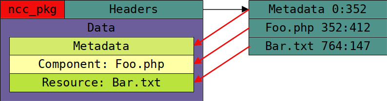

# ncc Documentation

This document serves the purpose of presenting the documentation for using/developing ncc, from basic installation,
basic usage, standards, and much more.

## Table of contents

<!-- TOC -->
* [ncc Documentation](#ncc-documentation)
  * [Table of contents](#table-of-contents)
  * [Introduction](#introduction)
    * [What is ncc?](#what-is-ncc)
    * [How does ncc work?](#how-does-ncc-work)
    * [What do I need to use ncc?](#what-do-i-need-to-use-ncc)
    * [How do I get started?](#how-do-i-get-started)
* [Building & installing ncc](#building--installing-ncc)
  * [Building from source](#building-from-source)
    * [Requirements to build](#requirements-to-build)
    * [Installing phpab](#installing-phpab)
    * [Building ncc](#building-ncc)
      * [Redist](#redist)
      * [Tar](#tar)
      * [Debian](#debian)
  * [Building ncc for docker](#building-ncc-for-docker)
  * [Installing ncc](#installing-ncc)
    * [Command line arguments](#command-line-arguments)
  * [Uninstalling ncc](#uninstalling-ncc)
* [Helpful Information](#helpful-information)
  * [Package Naming](#package-naming)
  * [Remote Package Syntax (RPS)](#remote-package-syntax-rps)
  * [ncc Binary Package](#ncc-binary-package)
    * [Package Header](#package-header)
    * [Package Data](#package-data)
* [ncc cli](#ncc-cli)
  * [Project Management (project)](#project-management-project)
    * [Creating a new project (create)](#creating-a-new-project-create)
    * [Applying Templates (template)](#applying-templates-template)
      * [phpcli template](#phpcli-template)
      * [phplib template](#phplib-template)
  * [Package Management (package or pkg)](#package-management-package-or-pkg)
    * [Listing Installed Packages (list)](#listing-installed-packages-list)
    * [Installing Packages (install)](#installing-packages-install)
    * [Uninstalling Packages (uninstall)](#uninstalling-packages-uninstall)
    * [Uninstalling All Packages (uninstall-all)](#uninstalling-all-packages-uninstall-all)
    * [Fix Broken Packages (fix-broken)](#fix-broken-packages-fix-broken)
  * [Credentials Management (cred)](#credentials-management-cred)
    * [Adding a credential (add)](#adding-a-credential-add)
    * [Removing a credential (remove)](#removing-a-credential-remove)
    * [Listing credential entries (list)](#listing-credential-entries-list)
  * [Managing Repositories (repository or repo)](#managing-repositories-repository-or-repo)
    * [Adding a repository (add)](#adding-a-repository-add)
    * [Removing a repository (remove)](#removing-a-repository-remove)
    * [Listing repositories (list)](#listing-repositories-list)
  * [Inspecting a package (ins)](#inspecting-a-package-ins)
    * [Package Information (info)](#package-information-info)
    * [Package Headers (headers)](#package-headers-headers)
    * [Package Metadata (metadata)](#package-metadata-metadata)
    * [Assembly Information (assembly)](#assembly-information-assembly)
    * [Package Dependencies (dependencies)](#package-dependencies-dependencies)
    * [Execution Units (execution_units)](#execution-units-executionunits)
  * [Building Projects (build)](#building-projects-build)
  * [Execute (exec)](#execute-exec)
* [Project Configuration (package.json)](#project-configuration-packagejson)
  * [Root Section](#root-section)
    * [Project (object)](#project-object)
      * [Compiler (object)](#compiler-object)
      * [UpdateSource (object)](#updatesource-object)
        * [Repository (object)](#repository-object)
    * [Assembly (object)](#assembly-object)
    * [Build (object)](#build-object)
<!-- TOC -->


------------------------------------------------------------------------------------------------------------------------


## Introduction

This section serves the basic introduction of ncc, what it's used for and how you can use it in your own projects or use 
it to run and build other projects that are designed to be used with ncc. 


### What is ncc?

ncc (*Acronym for **N**osial **C**ode **C**ompiler*) is a multipurpose compiler, package manager and toolkit. Allowing 
projects to be managed and built more easily without having to mess with all the traditional tools that comes with your 
language of choice. Right now ncc only supports PHP as it's written in PHP but extensions for other languages/frameworks
can be built into the software in the future when the need comes for it.

ncc can make the process of building your code into a redistributable package much more efficient by treating each 
building block of your project as a component that is interconnected in your environment instead of the more popular 
route taken by package/dependency managers such as [composer](https://getcomposer.org/) which attempts to copy what [npm](https://www.npmjs.com/) does but for
PHP, which is not a bad thing, but it's not the best approach for PHP and its ecosystem.


### How does ncc work?

ncc's command-line interface serves as the central hub for managing your projects and packages. This CLI empowers you to
perform tasks like project creation, package installation, and project building.

When you compile your project, it generates a "ncc package" file with a ".ncc" extension. This unique file consolidates
all essential project files, including the utilized components. Optionally, you have the flexibility to create a static
version of your project that contains all dependencies and components, simplifying deployment and execution across
different machines through a single file.

ncc harnesses these packages to install its dependencies and components globally, akin to how Composer installs packages
into a project's vendor directory. However, in ncc's case, it installs them into a global directory accessible to other
projects. Moreover, ncc can retrieve packages from various remote sources, including GitHub, GitLab, Gitea, and even 
Packagist. If ncc cannot locate a specific ncc package for a dependency or package, it will attempt to build it from 
source using the package's source code. Additionally, ncc features a compatibility layer for Composer packages, enabling 
you to install them without needing to install or use Composer itself.

You can imagine ncc as apt-get for PHP, but with a few extra features that make it more powerful and flexible.


### What do I need to use ncc?

ncc is a command-line tool, so you will need to be familiar with using the command-line interface. You will also need to
have PHP 8.0+ installed on your machine, along with the following PHP extensions:

- php-mbstring
- php-ctype
- php-common (covers tokenizer & posix among others)
- php-zip

These extensions are required for ncc to function properly, if you don't have these extensions installed, ncc may not
work correctly or may suffer from performance issues. For instance, `php-ctype` & `php-mbstring` are required for ncc
however, they will still work without them thanks to Symfony's polyfill library, but it's recommended to install the
extensions for better performance.


### How do I get started?

[RTFM](https://en.wikipedia.org/wiki/RTFM), this documentation is a good place to start, it covers everything you need
to know about ncc and how to use it.


------------------------------------------------------------------------------------------------------------------------


# Building & installing ncc

ncc must be built from source before it can be installed, this is because ncc is a PHP application and PHP applications
are not compiled into machine code, instead, they are compiled into a redistributable source that can be installed on
the machine. This includes the auto-loader files that ncc needs to locate its components and dependencies.


## Building from source

Building ncc from source is easy with very few requirements to start building. At the moment, ncc can only be debugged or
tested by building a redistributable source and installing it.

### Requirements to build

- php8.0+
- php-mbstring
- php-ctype
- php-common (covers tokenizer & posix among others)
- make
- phpab
- tar *(optional)*

For building different variants, such as building a debian package, you will need to install the required tools for that
specific variant. For more information, check the [Makefile](Makefile) for the required tools for a specific variant.

### Installing phpab

phpab is also known as [PHP Autoload Builder](https://github.com/theseer/Autoload), phpab is an open-source tool used 
for creating autoload files, ncc needs this tool in order to generate its autoload files whenever there are any changes
to its source code. This tool is only required for building and or creating a redistributable package of ncc.
This component is not required to be installed to use ncc.

for some components that require static loading, ncc will automatically load it using its own [autoloader](src/autoload/autoload.php)

The recommended way to install phpab is by using [phive](https://phar.io/), if you don't have phive installed, you can 
install it by running these commands in your terminal (from the official documentation)

```shell
wget -O phive.phar https://phar.io/releases/phive.phar
wget -O phive.phar.asc https://phar.io/releases/phive.phar.asc
gpg --keyserver hkps://keys.openpgp.org --recv-keys 0x9D8A98B29B2D5D79
gpg --verify phive.phar.asc phive.phar
chmod +x phive.phar
sudo mv phive.phar /usr/local/bin/phive
```

Once phive is installed, you can run the final command to install phpab

```shell
sudo phive install phpab --global
```

or you can run this command to install it locally

```shell
phive install phpab
```

**Note:** Optionally, you may want to have `phab` available in your `$PATH`, this can be done with this command. 
*(Replace `x.xx.x` with your version number)* this is if you installed it locally

```shell
ln -s /home/user/.phive/phars/phpab-x.xx.x.phar /usr/local/bin/phpab
```

### Building ncc

First, navigate to the main directory of ncc's source code where the [Makefile](Makefile) is present. If you
already attempted to or had built ncc before, it's  recommended to use `make clean` before building.

#### Redist

Running `redist` from the Makefile will generate all the required autoloader for ncc and move all the required files 
into one redistributable source folder under a directory called `build/src`

```shell
make redist
```


#### Tar

Running `tar` will run redist before packaging the redistributable source into a tar.gz file that can be distributed to 
other machines, this process is not a requirement.

```shell
make tar
```


#### Debian

Running `deb` will run `redist` before packaging the redistributable source into a debian package that can be installed
on debian based machines, this process is not a requirement.

```shell
make deb
```

Once you have a populated `build/ncc_x.x.x` folder, you can simply run execute the `installer` file to install your build
of ncc onto the running machine.

 > Note: you may need to run `sudo` before executing the installer file.


------------------------------------------------------------------------------------------------------------------------


## Building ncc for docker

ncc is also available for docker, you can build ncc for docker by running the `docker-debian` or `docker-alpine` make
tasks, this will build ncc for docker and create a docker image that you can use to run ncc.

```shell
make docker-debian docker-alpine
```

The respective docker files are located in 

- [Dockerfile Debian](Dockerfile.debian)
- [Dockerfile Alpine](Dockerfile)

You may also run and test these docker builds with the `docker-debian-run` and `docker-alpine-run` make tasks.

```shell
make docker-debian-run docker-alpine-run
```

 > Contributor Note: contributions are welcomed here to expand ncc's docker support to other distros and to improve the
 > existing docker files.

------------------------------------------------------------------------------------------------------------------------


## Installing ncc

Installing ncc is easy, you can either download the redistributable source from the [releases](https://git.n64.cc/nosial/ncc/-/releases)
page or you can build it from source using the instructions above.

Once you have the redistributable source, you can simply run execute the `INSTALL` file to install ncc onto the running 
machine. usually this installation process will require root privileges, so it's recommended to run the installer with
`sudo` or as root.


### Command line arguments

The installer accepts a few command line arguments that can be used to alter the installation process.

`--help` Displays the help message

`--bypass-cli-check` Bypasses the check in the installer that checks if the installer is being run from the command
line, this is useful if you want to install ncc from a script.

`--bypass-checksum` Bypasses the checksum check in the installer, this is useful if you made modifications to the 
installation files and want to install a modified version of ncc. But this isn't recommended, and the proper way to
do this is to modify the source code and build ncc from source, the Makefile task will automatically rebuild the
checksum file for you.


## Uninstalling ncc

Uninstalling ncc is easy, simply delete the directory where ncc was installed to, by default this is `/etc/ncc`.

It's recommended to run `ncc package --uninstall-all` before uninstalling ncc, this will uninstall all the packages
that were installed using ncc and remove any artifacts that is installed on the system such as symlink registrations
and so on.

**Note:**

- To delete all the data that ncc has created, you can also delete the `/usr/share/ncc` directory.
- Finally, remove the symlink that was created in `/usr/bin`to the `ncc` entry point file.


------------------------------------------------------------------------------------------------------------------------


# Helpful Information

This section covers helpful information about ncc, such as conventions, standards, and so on.


## Package Naming

ncc follows a package naming convention that is inspired by Java's package naming convention. This convention is
designed to ensure clarity, avoid naming conflicts, and make it easier to identify the origin of packages. Below
are the key rules for naming packages in ncc:

 - The package name must be in all lowercases
 - The package name must be in reverse domain notation
 - The package name must be separated by a dot `.`
 - The package name must not contain any special characters other than '-' or '_'
 - The package name must not contain any spaces

In PHP, similar to Java, package naming conventions follow the reversed domain notation. This means that a package name,
such as "symfony/process" in Composer, is transformed into "com.symfony.process" in PHP. The components of the package
name are separated by dots (".") to create a hierarchical structure.

It's essential to adhere to specific guidelines when naming packages in PHP:

 - **Character Limitation**: Package names should consist of only hyphens ("-") or underscores ("_") as special
   characters. This restriction ensures compatibility with both file systems and package management tools.
 - **Avoiding Spaces**: Spaces should be avoided in package names. The inclusion of spaces can lead to confusion and
   compatibility issues. Instead, use hyphens or underscores if spacing is necessary within a package name.


## Remote Package Syntax (RPS)

Remote packages are packages that are hosted on a remote source, such as GitHub, GitLab, Gitea, and so on. ncc uses
a special syntax for specifying remote packages, this syntax is called Remote Package Syntax or RPS for short.
This syntax is simply a query to tell ncc what package to install and where to install it from. This syntax is used when
installing packages from the command-line or defining dependencies in a project's package.json file.

The syntax for RPS is as follows:

```
<vendor>/<package-name>=<version>@<repository>
```

| Component      | Description                                                                                                   |
|----------------|---------------------------------------------------------------------------------------------------------------|
| `<vendor>`     | The vendor name of the package, this is usually the username or organization name on the source eg; symfony   |
| `<package>`    | The package name, this is the name of the package eg; console                                                 |
| `<version>`    | The version of the package to install, this can be a version number or simply "latest" for the latest version |
| `<repository>` | The repository to install the package from, this has to be a name of a repository that's configured in ncc    |

**Note:** The version number can be omitted, in which case ncc will install the latest version of the package.

Here are some examples of RPS:

```text
symfony/console=latest@packagist # installs the latest version of symfony/console from packagist
johndoe/hello_world=latest@github # installs the latest version of hello_world from github
```

For instances like Gitlab where organizations may have subgroups, you can specify the subgroup by using a dot (".")
to separate the group name from the subgroup name.

```text
nosial/libs.config@n64 # installs the latest version of ConfigLib from n64
nosial/libs.config=1.0.0@n64 # installs version 1.0.0 of ConfigLib from n64
```


## ncc Binary Package

ncc binary packages are packages that are compiled by ncc, these packages are used to install packages on the system and
can also be executed directly by ncc, the file format is a flexible memory safe archive type similiar to `PHAR` or the
`ZIP` file format. This section will attempt to explain the file sturcture of a binary package and how they work.



The ncc Binary Package File consists of three main sections: the package header, the package data, and the end of package marker.

### Package Header

The package header is the data that ncc will load into memory to be able to find data on the package without needing to
load the entire package into memory. The package begins with the magic bytes `ncc_pkg` followed by the header data,
this header data ends with the sequence of bytes `1F 1F 1F 1F` to indicate the end of the header data.


Once ncc is able to locate and decode the header data, it's able to identify where all the files and components are
located in the package, this is because the header data provides an offset and length for each component. It's up to
ncc's PackageReader to determine the correct offset to be able to read the data correctly, as ncc binary packages may
also be embedded into other files such as an executable file.

The header data is encoded using `msgpack` to ensure that the data is compact and can be decoded quickly, the header
cannot be compressed as it's required to be loaded into memory as-is.

### Package Data

After the end of the header marker, the package data begins, this is where all the files and components are located,
each component and file and it's data contents are not seperated or easily identifiable, this is because the package
data is located using the header data. The data section ends with the sequence of bytes `FF AA 55 F0` to indicate that
this is the end of the ncc binary package data, any data beyond that is not part of the package file.


The data sections can be any sort of data. Additionally, if the headers contain a flag for compression, ncc will attempt
to decompress the data as you read it, this is useful for reducing the size of the package file and to reduce the amount
of memory required to load the package into memory. Though this is optional and is not required for ncc to be able to
read the package file.


------------------------------------------------------------------------------------------------------------------------


# ncc cli

ncc's command-line interface serves as the central hub for managing your projects and packages. This CLI empowers you to
perform tasks like project creation, package installation, and project building.


## Project Management (project)

The command `project` provides a set of commands for managing projects, such as creating a new project and applying
a builtin template to a project. This part of the documentation will guide you through the process of creating a new
project and applying a template to it both for CLI-based projects and library projects.


### Creating a new project (create)

To create a new project, you can use the `project create` command, this command will create a new project in the current
working directory. You must specify details about the project you want to create, such as the project name, package name,
and the compiler extension to use.

| Option               | Required | Example             | Description                                                                                                   |
|----------------------|----------|---------------------|---------------------------------------------------------------------------------------------------------------|
| `--name`, `-n`       | Yes      | ExampleProject      | The name of the project                                                                                       |
| `--package`, `--pkg` | Yes      | com.example.project | The package name to use, see [Package Naming](#package-naming) for more information                           |
| `--path`, `-p`       | No       | example_project     | The directory to create/use to initialize the project in, if not provided then `--name` would be used instead |
| `--ext`              | No       | php                 | The compiler extension to use, defaults to `php`                                                              |

```shell
ncc project create --name ExampleProject --package com.example.project --ext php
```

Once the project is created, will see a new directory with the name of the project you specified, this directory will
contain the project's source code and other files that are required for the project to function properly, more importantly
it will contain the `package.json` file which is the project's configuration file that ncc uses to manage and build
the project.

### Applying Templates (template)

Templates are used to apply a predefined structure to a project, this is not a requirement but makes it easier to get
started with a project. ncc comes with a few builtin templates that you can use to create a project

| Template Name | Description                                 |
|---------------|---------------------------------------------|
| `phpcli`      | A template for creating a CLI-based project |
| `phplib`      | A template for creating a library project   |

To apply a template, simply use the `project template` command, this command will apply a template to the project in
the current working directory or the directory specified by the `--path` option.

| Option         | Required | Example         | Description                                                                                                                        |
|----------------|----------|-----------------|------------------------------------------------------------------------------------------------------------------------------------|
| `--name`, `-n` | Yes      | phpcli          | The name of the template to apply                                                                                                  |
| `--path`, `-p` | No       | example_project | The directory to create/use to apply the the template to, if not provided then the current working directory would be used instead |

```shell
ncc project template --name phpcli
```

Once the template is applied, you will see additional files and directories created by ncc; these files and directories
are part of the template and are required for the project to function properly, your project.json file will also be
updated to reflect the changes made by the template.

#### phpcli template

The phpcli template is a template for creating a CLI-based project, allowing you to create a CLI application with ease
similar to how C and C++ CLI applications are created. This section will demonstrate what the template does and how to
use it.

Assuming you have a project already created, if not, see [Creating a new project (create)](#creating-a-new-project-create)
for more information on how to create a new project.

```shell
$ ncc project create -n MyCommandLineProgram --pkg com.example.cli_program --ext php
No path specified, using 'MyCommandLineProgram'
Project successfully created in 'MyCommandLineProgram'
Modify the project configuration in 'MyCommandLineProgram/project.json
```

Once the project is created, you can apply the phpcli template to it.

```shell
$ ncc project template -p MyCommandLineProgram -n phpcli
Template successfully applied to project in 'MyCommandLineProgram'
```

Now if we take a look at the directory structure of the project, we will notice additional files and the project.json
file containing two new build configurations for creating an executable file of the project.

```shell
$ tree MyCommandLineProgram
MyCommandLineProgram/
├── main
├── Makefile
├── project.json
└── src
    └── MyCommandLineProgram
        └── Program.php

2 directories, 4 files
```

The `main` file is the entry point of the project, this is where the project starts, this is defined as a execution
policy in `project.json` as shown here

```json
{
  "execution_policies": [
    {
      "name": "main_policy",
      "runner": "php",
      "execute": {
        "working_directory": "%CWD%",
        "silent": false,
        "tty": true,
        "timeout": null,
        "idle_timeout": null,
        "target": "main"
      }
    }
  ]
}
```

Note how the target points to the `main` file, this is the file that will be executed when the project is executed, the
working directory is also configured to always use the current working directory as defined by the special constant
`%CWD%`, this is useful for CLI applications as it allows you to execute the application from any directory.

The `main` file can be altered however you want, but it serves one important purpose which is to determine how to self
execute itself

```php
<?php
    // First check if the script is being executed from the command line
    if (PHP_SAPI !== 'cli')
    {
        print('com.example.cli_program must be run from the command line.' . PHP_EOL);
        exit(1);
    }

    // Try to retrieve the command-line arguments
    if(!isset($argv))
    {
        if(isset($_SERVER['argv']))
        {
            $argv = $_SERVER['argv'];
        }
        else
        {
            print('com.example.cli_program failed to run, no $argv found.' . PHP_EOL);
            exit(1);
        }
    }

    // Import ncc
    require('ncc');
    
    // Import the package
    \ncc\Classes\Runtime::import('com.example.cli_program', 'latest');
    
    // Run the program
    exit(\MyCommandLineProgram\Program::main($argv));
```

 > **Note:** In a case where the package is not installed on the system, but rather executed directly, ncc will already
 > have the package imported to memory before-hand so that an import statement will be skipped and the package will be
 > loaded from the package instead. In both scenarios where the package is installed or directly executed, this code
 > will work without any issues.

After the execution unit runs this code, the control is passed onto the your Program class to which you can find in
`src/MyCommandLineProgram/Program.php`, this is where you can write your code for your CLI application.

```php
<?php

    namespace MyCommandLineProgram;

    class Program
    {
        /**
         * MyCommandLineProgram main entry point
         *
         * @param string[] $args Command-line arguments
         * @return int Exit code
         */
        public static function main(array $args): int
        {
            print("Hello World from com.example.cli_program!" . PHP_EOL);
            return 0;
        }
    }
```

To build this program you can run `ncc build` from the project's directory, this will build the project and create an
executable file in the `build` directory.

```shell
$ ncc build -p MyCommandLineProgram
Building project 'MyCommandLineProgram'
[ =========== ] 100% 2/2 remaining:  0 sec.  elapsed: 0 sec.  
build/release/com.example.cli_program.ncc
```

To test your program, you can run `ncc exec` on the compiled binary package

```shell
$ ncc exec --package MyCommandLineProgram/build/release/com.example.cli_program.ncc
Hello World from com.example.cli_program!
```

If you'd like to build a executable program of your project, you may look at the `project.json` file for the build
configuration that is used for building executable files, more specifically the `release_executable` and `debug_executable`
configurations. You may alter how these configurations work to suit your needs, but the `build_type` must be set to
`executable` rather than ncc, this template would already have created these configurations for you so all you'd have to
do is run the `build` command with the `--config` option to specify which configuration to use.

```shell
$ ncc build -p MyCommandLineProgram --config release_executable`
Building project 'MyCommandLineProgram'
[ =========== ] 100% 2/2 remaining:  0 sec.  elapsed: 0 sec.  
Processing build/release/com.example.cli_program.ncc to hex dump
[ =========== ] 100% 3063/3063 remaining:  0 sec.  elapsed: 0 sec.  
build/release/MyCommandLineProgram
```

Now you may directly run the program without the need of `ncc exec`

```shell
$ MyCommandLineProgram/build/release/MyCommandLineProgram
Hello World from com.example.cli_program!
```

#### phplib template

The phplib template is a template for creating a library project, allowing you to create a library with ease similar to
creating a CLI program, this section will guide you through how to create a library for your program and how to use it
as a dependency in another project. This section will use the previous `phpcli` template as a base for creating a library
to use in a CLI program.

First, let's begin by creating a new project.

```shell
$ ncc project create -n MyLibrary --pkg com.example.library --ext php
No path specified, using 'MyLibrary'
Project successfully created in 'MyLibrary'
Modify the project configuration in 'MyLibrary/project.json'
````

Next, let's apply the `phplib` template to the project.

```shell
$ ncc project template -p MyLibrary -n phplib
Template successfully applied to project in 'MyLibrary'
```

Similarly to phpcli, additional files will be created for your project

```shell
$ tree MyLibrary
MyLibrary/
├── Makefile
├── project.json
└── src
    └── MyLibrary
        └── MyLibrary.php
```

This is a blank library, you can write your code however you want, but for this example we are going to demonstrate
a function call with this template to show how it works, first we'll modify the `MyLibrary.php` file to add a function
that returns a string.

```php
<?php

    namespace MyLibrary;

    class MyLibrary
    {
        public function getName(string $name): string
        {
                return sprintf("Hello %s!", $name);
        }
    }
```

Next, we'll build the library

```shell
$ ncc build -p MyLibrary
Building project 'MyLibrary'
[ =========== ] 100% 1/1 remaining:  0 sec.  elapsed: 0 sec.  
build/release/com.example.library.ncc
```

Finally, we'll install it onto the system so we can actually use it

```shell
$ sudo ncc package install -p build/release/com.example.library.ncc -y
Package installation information:
   UUID: de1df7b6-108f-4cfc-a818-416bad08daa9
   Name: MyLibrary
   Package: com.example.library
   Version: 1.0.0

Installing package com.example.library=1.0.0
[ =========== ] 100% 7/7 remaining:  0 sec.  elapsed: 0 sec.  
Installed 1 packages
```

Now we should be able to see the package on the system when we run `ncc package list`

```shell
$ ncc package list
   com.example.library=1.0.0
Total: 1 packages
```

Great! We created a library and installed it onto the system, let's test it by running `php -a` to open the PHP shell
and import the package and test its function call

```shell
$ php -a

Interactive shell

php > require 'ncc';
php > import('com.example.library');
php > 
php > $my_library = new \MyLibrary\MyLibrary();
php > echo $my_library->getName('John');
Hello John!
```

But libraries are usually used by other programs, so let's go back to our `MyCommandLineProgram` project and use the
library we just created. If you don't have the project, you can create it by following the steps in the
[phpcli template](#phpcli-template) section.

First, we'll need to add the library as a dependency to the project, this can be done by editing the `project.json` in
the `build` section by creating an array of dependencies you need, a dependency looks something like this once it's
defined in `project.json`

```json
{
  "dependencies": [
      {
        "name": "com.example.library",
        "version": "latest"
      }
  ]
}
```

Now if you hosted your project on a remote source, you may also define where ncc should get the package from if the
dependency is not available on the system.

```json
{
  "dependencies": [
      {
        "name": "com.example.library",
        "version": "latest",
        "source": "johndoe/example_library=latest@n64"
      }
  ]
}
```

overall, your project.json file should look something like this

```json
{
    "project": {
        "compiler": {
            "extension": "php",
            "minimum_version": "8.2",
            "maximum_version": "8.0"
        },
        "options": {
            "create_symlink": true
        }
    },
    "assembly": {
        "name": "MyCommandLineProgram",
        "package": "com.example.cli_program",
        "version": "1.0.0",
        "uuid": "462a7f76-2cdc-428a-bbc6-c5feba614799"
    },
    "build": {
        "source_path": "src/MyCommandLineProgram",
        "default_configuration": "release",
        "main": "main_policy",
        "define_constants": {
            "ASSEMBLY_PACKAGE": "%ASSEMBLY.PACKAGE%",
            "ASSEMBLY_VERSION": "%ASSEMBLY.VERSION%",
            "ASSEMBLY_UID": "%ASSEMBLY.UID%"
        },
	    "dependencies": [
            {
              "name": "com.example.library", 
              "version": "latest"
            }
	    ],
        "configurations": [
            {
                "name": "release",
                "build_type": "ncc",
                "output": "build/release/%ASSEMBLY.PACKAGE%.ncc"
            },
            {
                "name": "debug",
                "build_type": "ncc",
                "output": "build/debug/%ASSEMBLY.PACKAGE%.ncc",
                "define_constants": {
                    "DEBUG": "1"
                }
            },
            {
                "name": "release_executable",
                "build_type": "executable",
                "output": "build/release/%ASSEMBLY.NAME%",
                "options": {
                    "ncc_configuration": "release"
                }
            },
            {
                "name": "debug_executable",
                "build_type": "executable",
                "output": "build/debug/%ASSEMBLY.NAME%",
                "options": {
                    "ncc_configuration": "debug"
                },
                "define_constants": {
                    "DEBUG": "1"
                }
            }
        ]
    },
    "execution_policies": [
        {
            "name": "main_policy",
            "runner": "php",
            "execute": {
                "working_directory": "%CWD%",
                "silent": false,
                "tty": true,
                "timeout": null,
                "idle_timeout": null,
                "target": "main"
            }
        }
    ]
}
```

Once you have defined the dependency on your program, let's modify the CLI program to use the library we created, we'll
modify the `src/MyCommandLineProgram/Program.php` file to use the library.

```php
<?php

    namespace MyCommandLineProgram;

    class Program
    {
        /**
         * MyCommandLineProgram main entry point
         *
         * @param string[] $args Command-line arguments
         * @return int Exit code
         */
        public static function main(array $args): int
        {
            // Create a new instance of the library
            $my_library = new \MyLibrary\MyLibrary();
            
            // Call the getName function
            print($my_library->getName('John') . PHP_EOL);
            
            return 0;
        }
    }
```

Notice how we don't use the `import()` function to import the package, this is because ncc's import system will take a
look at the requirements that your package needs and automatically import them for you, this is useful for CLI programs
as it allows you to import packages without having to worry about whether the package is installed or not. This works
recursively, so if the package you imported also has a dependency, it will also be imported.

Now let's build the program

```shell
$ ncc build -p MyCommandLineProgram
Building project 'MyCommandLineProgram'
[ =========== ] 100% 2/2 remaining:  0 sec.  elapsed: 0 sec.  
build/release/com.example.cli_program.ncc
```

And let's test it!

```shell
$ ncc exec --package MyCommandLineProgram/build/release/com.example.cli_program.ncc
Hello John!
```

Great! We successfully created a library and used it in a CLI program, this is just a simple example of how to use the
phplib template, you can use it however you want to create your own libraries and use them in your projects.

If you'd like to create a build a static version of your package where all your dependencies are bundled into one file,
you can modify the project.json file to achieve this, more specifically the build configuration, in this case the
default build configuration we're using is called `release` so we'd need to adjust the configuration as so by adding the
`static` option to the configuration.

```json
{
    "name": "release",
    "build_type": "ncc",
    "output": "build/release/%ASSEMBLY.PACKAGE%.ncc",
    "options": {
        "static": true
    }
}
```

Now let's build the program again and test it

```shell
$ ncc build -p MyCommandLineProgram
Building project 'MyCommandLineProgram'
[ =========== ] 100% 2/2 remaining:  0 sec.  elapsed: 0 sec.
$ ncc exec --package MyCommandLineProgram/build/release/com.example.cli_program.ncc
Hello John!
```

And if you'd like to confirm if the dependencies are actually bundled into your program, you may ues the package
inspection command to view its headers, inside it you'll notice the components for `MyLibrary` being bundled into the
package.

```shell
$ ncc ins -p MyCommandLineProgram/build/release/com.example.cli_program.ncc headers
headers
1937008233: '2.0'
1936941414:
  - static_dependencies
1869898597:
  '@1835365473': '0:137'
  '@1634956133': '137:114'
  '@1702389091:main_policy': '251:868'
  '@1668246896:src/MyCommandLineProgram/Program.php': '1119:2996'
  '@1668047219:MyCommandLineProgram\Program': '1119:2996'
  '@1684369509:com.example.library': '4115:40'
  '@1668246896:src/MyLibrary.php': '4155:1366'
  '@1668047219:MyLibrary\MyLibrary': '4155:1366
```

You may uninstall the package `com.example.library` from the system and try to run the program again, you'll notice that
the program will still run without any issues, this is because the package is bundled into the program itself.

```shell
$ sudo ncc package uninstall -p com.example.library -y
Uninstalling package com.example.library=1.0.0
Uninstalled 1 packages

$ ncc exec --package MyCommandLineProgram/build/release/com.example.cli_program.ncc
Hello John!
```

And that's the magic that ncc does for you, it allows you to create libraries and bundle them into your programs without
having to worry about whether the library is installed or not, and with its import system you no longer have to worry
about autoloaders or anything like that, ncc will take care of that for you. This is what composer cannot do, composer
can only install packages onto your project directory, but it cannot bundle them into your programs if you wish to 
have an easy way to distribute your project to other people, this is where ncc shines.

## Package Management (package or pkg)

The command `package` provides a set of commands for managing packages, such as installing packages and uninstalling
packages, `pkg` is an alias for `package` and can be used interchangeably.

> **Note:** that most of these operations requires root privileges, so it's recommended to run ncc with `sudo` or as root.

### Listing Installed Packages (list)

To list all the installed packages, you can use the `package list` command, this command will list all the installed
packages and their versions.

```shell
$ ncc package list
   com.symfony.console=2.0.7
   com.symfony.polyfill_php72=v1.28.0
   com.symfony.http_kernel=2.0.7
   com.symfony.event_dispatcher=2.0.7
Total: 4 packages
```


### Installing Packages (install)

To install a package, you can use the `package install` command, this command will install the specified package and
all its dependencies. There are two ways to install a package, you can either install a package from a remote source
or install a package from a local source such as a local .ncc file.

| Option                   | Required | Example                                                         | Description                                                                                                                                                                               |
|--------------------------|----------|-----------------------------------------------------------------|-------------------------------------------------------------------------------------------------------------------------------------------------------------------------------------------|
| `--package`, `-p`        | Yes      | `symfony/process=latest@packagist` or `com.example.package.ncc` | The package to install it can be a remote package or a local package, see [Remote Package Syntax (RPS)](#remote-package-syntax-rps) for more information when installing a remote package |
| `--version`, `-v`        | No       | `1.0.0` or `latest`                                             | The version of the package to install, defaults to `latest`                                                                                                                               |
| `--reinstall`            | No       | Not Applicable                                                  | Reinstall the package even if it's already installed                                                                                                                                      |
| `--skip-dependencies`    | No       | Not Applicable                                                  | Skips installing the package's dependencies                                                                                                                                               |
| `--authentication`, `-a` | No       | johndoe                                                         | The authentication credential to use when pulling from private repositories, see [Credentials Management (cred)](#credentials-management-cred) for more information                       |
| `-y`                     | No       | Not Applicable                                                  | Skips the confirmation prompt when installing a package                                                                                                                                   |

```shell
ncc package install -p symfony/process=latest@packagist -y
```

 > **Note** When installing a package from a local file such as a packge.ncc file, ncc will display information about
 > the package and ask you to confirm the installation before installing the package, but for remote packages, ncc will
 > cannot display this information without downloading the package first, so it will ask you to confirm the installation

### Uninstalling Packages (uninstall)

To uninstall a package, you can use the `package uninstall` command, this command will uninstall the specified package.
If you don't specify a version, ncc will uninstall all versions of the package.

| Option            | Required | Example                                        | Description                                                                      |
|-------------------|----------|------------------------------------------------|----------------------------------------------------------------------------------|
| `--package`, `-p` | Yes      | `com.example.package` or `com.symfony.process` | The package to uninstall                                                         |
| `--version`, `-v` | No       | `1.0.0` or `latest`                            | The version to uninstall, if not specified then all versions will be uninstalled |
| `-y`              | No       | Not Applicable                                 | Skips the confirmation prompt when uninstalling a package                        |

```shell
ncc package uninstall -p symfony/process -v 1.0.0 -y
```

### Uninstalling All Packages (uninstall-all)

To uninstall all packages, you can use the `package uninstall-all` command, this command will uninstall all the packages
that were installed using ncc. This command does not accept any options other than `-y` to skip the confirmation prompt.

```shell
ncc package uninstall-all -y
```

### Fix Broken Packages (fix-broken)

To fix broken packages, you can use the `package fix-broken` command, this command will attempt to fix or uninstall
packages that are broken. This command does not accept any options other than `-y` to skip the confirmation prompt.

The command does the following checks

 - Check each package to see if they are broken eg; missing files, or any other unrecoverable error that would
   prevent the package from being loaded correctly, these packages will be uninstalled.
 - Check each package's dependencies to see if they are installed, if not, it will try to determine all the missing
   dependencies.

```shell
ncc package fix-broken -y
```


## Credentials Management (cred)

Credentials are used in ncc to pull packages from private sources, such as private repositories on GitHub, GitLab, Gitea,
and so on. ncc uses a credential manager to manage credentials for these sources, this command provides a set of commands
for managing credentials.

All credentials stored by ncc are encrypted using the provided token/password, this means each entry in the credential manager
is encrypted and requires a secret to decrypt it, so even if the credential database can be accessed, the credentials
cannot be decrypted without the secret.

 > **Note:** The credential manager is not a password manager, it's only used to store credentials for private sources
 > such as private repositories on GitHub, GitLab, Gitea, and so on, root access is required to access and make changes
 > to the credential manager. The credential database is only accessible by root.

### Adding a credential (add)

To add a credential, you can use the `cred add` command, this command will add a new credential to the credential manager,
this command will prompt you to enter the credential details such as the credential name, the credential type, and the
credential token/password, if you provide the options needed for these details, you can skip the prompts by using the
options instead.

| Option        | Required       | Example          | Description                                                                                              |
|---------------|----------------|------------------|----------------------------------------------------------------------------------------------------------|
| `--alias`     | Yes            | `johndoe`        | The alias of the credential                                                                              |
| `--auth-type` | Yes            | `login` or `pat` | The type of the credential, can either be `login` (Username & Password) or `pat` (Personal Access Token) |
| `--username`  | Yes if `login` | `johndoe`        | The username of the credential, only required if the credential type is `login`                          |
| `--password`  | Yes if `login` | `password`       | The password of the credential, only required if the credential type is `login`                          |
| `--token`     | Yes if `pat`   | `token`          | The token of the credential, only required if the credential type is `pat`                               |

For instance, to add a username/password entry, you can use the following command

```shell
ncc cred add --alias johndoe --auth-type login --username johndoe --password <password>
```

And similar for private access tokens

```shell
ncc cred add --alias secretdoe --auth-type pat --token <token>
```

When installing a package, you may pass on the `--authentication` or `-a` option to specify the credential to use when
pulling from private repositories, this option accepts the alias of the credential to use.

```shell
ncc package install -p com.example.package -a johndoe
```

### Removing a credential (remove)

To remove a credential, you can use the `cred remove` command, this command will remove a credential from the credential
manager, this command requires the '--alias' option to specify the credential to remove.

| Option    | Required | Example   | Description           |
|-----------|----------|-----------|-----------------------|
| `--alias` | Yes      | `johndoe` | The alias of the user |

```shell
ncc cred remove --alias johndoe
```


### Listing credential entries (list)

To list all the credential entries, you can use the `cred list` command, this command will list all the credential entries
in the credential manager.

```shell
$ ncc cred list
Entries:
 - johndoe  (encrypted)
 - secretdoe  (encrypted)
Total: 2
```


## Managing Repositories (repository or repo)

Repositories are used in ncc to pull packages from remote sources, such as GitHub, GitLab, Gitea, and so on. ncc uses
a repository manager to manage repositories for these sources, this command provides a set of commands for managing
repositories.

Note that ncc currently supports the following repository types:

 - GitHub
 - GitLab
 - Gitea
 - Packagist

And by default, ncc comes with the following repositories:

| Name       | Type      | Host                                               | Description                                                                                        |
|------------|-----------|----------------------------------------------------|----------------------------------------------------------------------------------------------------|
| n64        | gitlab    | [git.n64.cc](https://git.n64.cc)                   | The official n64 git instance, maintained by Nosial & a community of volunteers                    |
| packagist  | packagist | [packagist.org](https://packagist.org)             | The official Packagist repository, mainly used for Composer packages                               |
| github     | github    | [github.com](https://github.com)                   | GitHub's official Git instance                                                                     |
| gitlab     | gitlab    | [gitlab.com](https://gitlab.com)                   | GitLab's official Git instance                                                                     |
| gitgud     | gitlab    | [gitgud.io](https://gitgud.io)                     | Gitgud's public GitLab instance, maintained by a community of volunteers                           |
| nocturn9x  | gitea     | [git.nocturn9x.space](https://git.nocturn9x.space) | Nocturn9x's private Gitea instance, maintained by a community of volunteers from the private cloud |
| martinvlba | gitea     | [git.martinvlba.eu](https://git.martinvlba.eu)     | Martinvlba's public Gitea instance, maintained by the site owner                                   |
| kuny       | gitea     | [git.it-kuny.ch](https://git.it-kuny.ch)           | Kuny's public Gitea instance, maintained by the site owner                                         |

If you'd like to add your own repository to ncc as a default repository, you can submit a pull request to add it to
the [repositories.json](src/config/default_repositories.json) file, this file contains all the default repositories
that ncc will attempt to add when first installing ncc.


### Adding a repository (add)

To add a repository to ncc, you can use the `repo add` command, this command will add a new repository to the repository
manager, this command requires you to provide the repository name, the repository type, and the repository host.

| Option   | Required | Example           | Description                                                                                                                |
|----------|----------|-------------------|----------------------------------------------------------------------------------------------------------------------------|
| `--name` | Yes      | `n64`             | The name of the repository                                                                                                 |
| `--type` | Yes      | `gitlab`          | The type of the repository, can either be `gitlab`, `github`, `gitea`, or `packagist`                                      |
| `--host` | Yes      | `git.n64.cc`      | The host of the repository, this is the URL to the repository eg; `git.n64.cc` for the n64 repository (Without http/https) |
| `--ssl`  | No       | `true` or `false` | Whether or not to use SSL when connecting to the repository, defaults to `true`                                            |

```shell
ncc repo add --name n64 --type gitlab --host git.n64.cc
```

### Removing a repository (remove)

To remove a repository, you can use the `repo remove` command, this command will remove a repository from the repository
manager, this command requires the '--name' option to specify the repository to remove.

| Option   | Required | Example | Description      |
|----------|----------|---------|------------------|
| `--name` | Yes      | `n64`   | The name of repo |

```shell
ncc repo remove --name n64
```

### Listing repositories (list)

To list all the repositories, you can use the `repo list` command, this command will list all the repositories in the
repository manager.

```shell
$ ncc repo list
 - n64 (git.n64.cc) [gitlab]
 - packagist (packagist.org) [packagist]
 - github (api.github.com) [github]
 - gitlab (gitlab.com) [gitlab]
 - gitgud (gitgud.io) [gitlab]
 - nocturn9x (git.nocturn9x.space) [gitea]
 - martinvlba (git.martinvlba.eu) [gitea]
 - kuny (git.it-kuny.ch) [gitea]
Total: 8
```

## Inspecting a package (ins)

This is more of a debugging tool, but it can be useful for inspecting a package to see what files are included in the
package and what dependencies are required by the package, this command accepts multiple commands that can be used to
inspect a package and display information about it, you can also inspect executable binaries if they contain the
binary package data.

To use this command, you need to specify the `--path` or `-p` option to specify the package to inspect, this must be a 
local package file. You cannot inspect packages installed on your system using this command.

You may also pass on the `--json` or `--json-pretty` option to output the information in JSON format, this is useful
for debugging or if you want to use the output in a script.

### Package Information (info)

This command allows you to print out very basic information about the package's structure, such as where ncc detects
different sections of the package.

```shell
$ ncc ins -p com.example.program.ncc info

File Version: 2.0
crc32: bb0feb59
sha256: c25f0c7e2a30a98e76331dd9dc4589afa8d3a800a069ad8be8b7566a132bd26e
Flags: gzip
Package Offset: 12320
Package Length: 2989
Header Offset: 12327
Header Length: 184
Data Offset: 12515
Data Length: 2790
Directory Size: 5 items
```

 - File Version: The version of the ncc binary package file format
 - crc32: The CRC32 checksum of the package itself, this is not the same as entirty of the file.
 - sha256: The SHA256 checksum of the package itself, this is not the same as entirty of the file.
 - Flags: The flags that were used when building the package, this is used to determine how to read the package.
 - Package Offset: The offset of the entire package data in the file.
 - Package Length: The length of the entire package data in the file.
 - Header Offset: The offset of the package header section in the file.
 - Header Length: The length of the package header section in the file.
 - Data Offset: The offset of the package data section in the file.
 - Data Length: The length of the package data section in the file.
 - Directory Size: The number of items in the package

### Package Headers (headers)

This command allows you to print out the package headers, this includes information about how ncc can read the package
and what contents are included in the package, this is a raw decoded representation of the package headers.

```shell
$ ncc ins -p com.example.program.ncc headers

1937008233: '2.0'
1936941414: {  }
1869898597:
  '@1835365473': '0:129'
  '@1634956133': '129:98'
  '@1702389091:main_policy': '227:828'
  '@1668246896:src/TestProgram/Program.php': '1055:1735'
  '@1668047219:TestProgram\Program': '1055:1735'
```

### Package Metadata (metadata)

This command allows you to print out the package metadata, this includes minimal information associated with the package
that tells ncc how to handle the package and how to execute it.

```shell
$ ncc ins -p com.example.program.ncc metadata

compiler_extension:
  extension: php
  minimum_version: '8.2'
  maximum_version: '8.0'
compiler_version: 2.0.0
update_source: null
installer: null
main_execution_policy: main_policy
options:
  create_symlink: true
```

### Assembly Information (assembly)

This command allows you to print out the package assembly information, this includes information about the package's
name, description, uuid and other attributes provided by the package.

```shell
$ ncc ins -p com.example.program.ncc assembly

name: TestProgram
package: com.example.test
version: 1.0.0
uuid: 25f93a3d-3cfc-49ed-aed4-d182dd804f48
```

### Package Dependencies (dependencies)

This command allows you to print out the package dependencies, this includes information about the package's dependencies
and what versions are required by the package.

```shell
$ ncc ins -p com.example.program.ncc dependencies

com.symfony.console: 2.0.7
com.symfony.polyfill_php72: v1.28.0
com.symfony.http_kernel: 2.0.7
```

### Execution Units (execution_units)

The execution units are the entry points of the package, this command allows you to print out the package's execution
units, this includes information about the package's execution units and what attributes are required by the package.

```shell
$ ncc ins -p com.example.program.ncc execution_units

-
  execution_policy:
    name: main_policy
    runner: php
    execute:
      working_directory: '%CWD%'
      options: {  }
      environment_variables: {  }
      silent: false
      tty: true
      timeout: null
      idle_timeout: null
      target: main
  data: <base64 data here>
```

## Building Projects (build)

The build command is responsible for building projects, this command will build the project in the current working
directory or the directory specified by the `--path` option.

| Option           | Required | Example        | Description                                                                                                                   |
|------------------|----------|----------------|-------------------------------------------------------------------------------------------------------------------------------|
| `--path`, `-p`   | No       | ExampleProject | The directory to create/use to build the project in, if not provided then the current working directory would be used instead |
| `--config`, `-c` | No       | `release`      | The build configuration file to use, if not provided then the default build configuration will be used instead                |
| `--output`, `-o` | No       | `program`      | The output file to produce, if not provided then the default output in your build configuration will be used instead          |

```shell
ncc build
```

```shell
ncc build --config release_executable --output program
```

## Execute (exec)

The execute command is responsible for executing packages, this command can execute packages that are installed on your
system, or you can specify a package to execute from directly.

 > **Note:** Depending on if the package is statically built, you need to ensure that you have the required dependencies
 > installed on your system, if you don't have the required dependencies installed, the package will fail to execute.

| Option           | Required | Example                                                                           | Description                                                                                                                                     |
|------------------|----------|-----------------------------------------------------------------------------------|-------------------------------------------------------------------------------------------------------------------------------------------------|
| `--package`      | Yes      | `com.example.program` (From the system) or `com.example.program.ncc` (Local file) | The package to execute, this can either be a package installed on your system or a local package file                                           |
| `--exec-version` | No       | `1.0.0` or `latest`                                                               | The version of the package to execute if the package is installed on your system, defaults to `latest`                                          |
| `--exec-args`    | No       | `--arg1 --arg2`                                                                   | The arguments to pass to the package when executing it, this has to be the last option in the command before the options to pass to the package |

```shell
ncc exec --package com.example.program --exec-version latest --exec-args --arg1 --arg2
```

```shell
ncc exec --package com.example.program.ncc --exec-args --arg1 --arg2
```

The exit code of the package will be returned as the exit code of the command, if the package fails to execute, the
command will return an exit code of 1 and display the error details.


------------------------------------------------------------------------------------------------------------------------


Certainly, here's an expanded version of your project configuration documentation with even more details:


# Project Configuration (package.json)

The project configuration file is the cornerstone of managing your project in `ncc`. It contains comprehensive
information about your project and how it should be built. Without this file, `ncc` won't have the necessary
instructions to compile your project effectively. This section aims to provide an in-depth explanation of the structure
of the project configuration file and the purpose of each section.

## Root Section

The root section serves as the foundation of the project configuration file, housing all the essential information about
your project and its build process. It is a pivotal section that instructs `ncc` on how to manage your project effectively.

| Property Name        | Object Type                    | Required | Example | Description                                                                                                                                                                                                                       |
|----------------------|--------------------------------|----------|---------|-----------------------------------------------------------------------------------------------------------------------------------------------------------------------------------------------------------------------------------|
| `project`            | [`Project`](#project-object)   | Yes      | N/A     | The primary project configuration defining how `ncc` compiles and handles the package. This object contains essential settings for your project.                                                                                  |
| `assembly`           | [`Assembly`](#assembly-object) | Yes      | N/A     | Metadata information about the project, providing details such as the project's name, version, and author.                                                                                                                        |
| `build`              | `Build`                        | Yes      | N/A     | Build Configuration for the project, encompassing additional configuration options to guide `ncc` in building the project. This section houses build-specific settings.                                                           |
| `execution_policies` | `ExecutionPolicy[]`            | No       | N/A     | An array of execution policies defined within the project. Execution policies determine how different parts of the project should run after compilation. These policies offer fine-grained control and are optional.              |
| `installer`          | `Installer`                    | No       | N/A     | Installer configuration for specifying how the installation process is managed. Note that this feature is a work in progress (WIP) and is not yet available. It enables you to configure how the package installation is handled. |

### Project (object)

The project section is the core of your project's configuration, dictating how `ncc` compiles and manages your package.
This object defines essential settings for your project.

| Property Name   | Object Type                            | Required | Example | Description                                                                                                                                                                                                           |
|-----------------|----------------------------------------|----------|---------|-----------------------------------------------------------------------------------------------------------------------------------------------------------------------------------------------------------------------|
| `compiler`      | [`Compiler`](#compiler-object)         | Yes      | N/A     | Compiler configuration for the project. This property is crucial as it informs `ncc` about the type of project and how to compile it for a specific version.                                                          |
| `options`       | `array`                                | No       | N/A     | An associative array of options. These options can be passed on to the compiler or package installer to customize the build process. This property is optional.                                                       |
| `update_source` | [`UpdateSource`](#updatesource-object) | No       | N/A     | An `UpdateSource` object that allows your package to receive updates from its remote source. This feature enables you to add new repositories to the system when you install the package. It is an optional property. |

#### Compiler (object)

Compiler configuration is pivotal for the project, informing `ncc` about the project type and how to compile it accurately.

| Property Name     | Object Type | Required | Example | Description                                                                                                           |
|-------------------|-------------|----------|---------|-----------------------------------------------------------------------------------------------------------------------|
| `extension`       | `string`    | Yes      | `php`   | The compiler extension used. Currently, only `php` is supported as an extension for the compiler.                     |
| `minimum_version` | `string`    | Yes      | `8.0`   | The minimum version of the compiler required for the project, ensuring compatibility with specific compiler versions. |
| `maximum_version` | `string`    | Yes      | `8.2`   | The maximum version of the compiler allowed for the project, setting an upper limit on compiler compatibility.        |

#### UpdateSource (object)

The `UpdateSource` object enables your package to receive updates from its remote source, allowing you to add new
repositories to the system during package installation.

| Property Name | Object Type                        | Required | Example                            | Description                                                                                                                                                              |
|---------------|------------------------------------|----------|------------------------------------|--------------------------------------------------------------------------------------------------------------------------------------------------------------------------|
| `source`      | `string`                           | Yes      | `symfony/process=latest@packagist` | The [Remote Package Syntax (RPS)](#remote-package-syntax-rps) for instructing `ncc` how to fetch this package. This syntax specifies the package and its version source. |
| `repository`  | [`Repository`](#repository-object) | No       | N/A                                | The repository configuration to add to the system. This allows you to define additional repositories, such as Packagist. This property is optional.                      |

##### Repository (object)

The repository configuration defines additional repositories, like Packagist, that can be added to the system.
This is an optional property.

| Property Name | Object Type | Required | Example      | Description                                                                                                                                                                      |
|---------------|-------------|----------|--------------|----------------------------------------------------------------------------------------------------------------------------------------------------------------------------------|
| `name`        | `string`    | Yes      | `n64`        | The repository's name for system registration, serving as its identifier.                                                                                                        |
| `type`        | `string`    | Yes      | `gitlab`     | The repository's type, which can be `github`, `gitlab`, `gitea`, or `packagist`.                                                                                                 |
| `host`        | `string`    | Yes      | `git.n64.cc` | The repository's host without the protocol (e.g., http/https), specifying the server hosting the repository.                                                                     |
| `ssl`         | `boolean`   | No       | `True`       | An optional property determining whether SSL should be used when sending requests to the repository's server. If `True`, SSL is enabled; if omitted or `False`, SSL is not used. |

### Assembly (object)

The `Assembly` object furnishes metadata about your project, including its name, version, author, and more.

| Property Name | Object Type        | Required | Example                                   | Description                                                                                                                                               |
|---------------|--------------------|----------|-------------------------------------------|-----------------------------------------------------------------------------------------------------------------------------------------------------------|
| `uuid`        | `string` (UUID v4) | Yes      | `2675498a-829e-4d1a-abdf-b9dbea8005c6`    | The Universally Unique Identifier (UUID) for the project. This is generated by `ncc` when you first create a project and is used to uniquely identify it. |
| `name`        | `string`           | Yes      | `ExampleLibrary`                          | The project's name. It's crucial to avoid special characters and spaces when naming the project, as it serves as a unique identifier.                     |
| `package`     | `string`           | Yes      | `com.example.library`                     | The package name, following package naming conventions, similar to Java packages.                                                                         |
| `version`     | `string`           | Yes      | `1.0.0`                                   | The package version, adhering to the Semantic Versioning format to accurately indicate the project's version.                                             |
| `description` | `string`           | No       | `This is an example library built in ncc` | An optional description of the project, providing insights into its functionality.                                                                        |
| `company`     | `string`           | No       | `Nosial`                                  | An optional field for specifying the company or vendor name responsible for maintaining the package.                                                      |
| `copyright`   | `string`           | No       | `Copyright 2022-2023 Nosial`              | An optional field for indicating the copyright associated with the package.                                                                               |
| `trademark`   | `string`           | No       | `Nosial`                                  | An optional field for specifying any trademarks associated with the package.                                                                              |

### Build (object)

The build section is responsible for defining the build configuration for the project, encompassing additional
configuration options to guide `ncc` in building the project. This section houses build-specific settings and one or
more build configurations.

| Property Name           | Object Type            | Required | Example                                   | Description                                                                                                  |
|-------------------------|------------------------|----------|-------------------------------------------|--------------------------------------------------------------------------------------------------------------|
| `source_path`           | `string`               | Yes      | `src`                                     | The path to the source directory, relative to the project root.                                              |
| `default_configuration` | `string`               | Yes      | `release`                                 | The default build configuration to use when building the project.                                            |
| `exclude_files`         | `string[]`             | No       | `["*.md", "*.txt"]`                       | An array of glob patterns to exclude from the build.                                                         |
| `options`               | `array`                | No       | N/A                                       | An associative array of options.                                                                             |
| `main`                  | `string`               | No       | `main_policy`                             | The main execution policy to use when executing the package.                                                 |
| `define_constants`      | `array`                | No       | `{ "DEBUG": true }`                       | An associative array of constants to define when importing the package, this feature is not yet implemented. |
| `pre_build`             | `string[]`             | No       | `["pre_setup_policy", "cleanup_policy"]`  | An array of execution policies to run before building the project, this feature is not yet implemented.      |
| `post_build`            | `string[]`             | No       | `["post_setup_policy", "cleanup_policy"]` | An array of execution policies to run after building the project, this feature is not yet implemented.       |
| `dependencies`          | `Dependency[]`         | No       | N/A                                       | An array of dependencies to install or use when building the project.                                        |
| `build_configurations`  | `BuildConfiguration[]` | No       | N/A                                       | An array of build configurations to use when building the project.                                           |